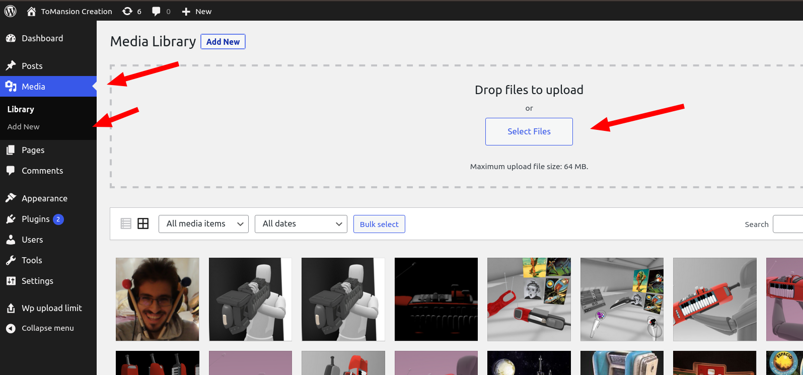
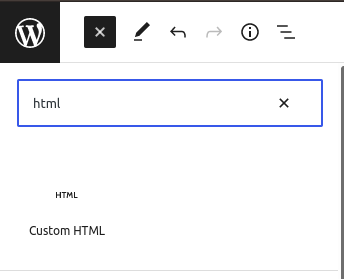
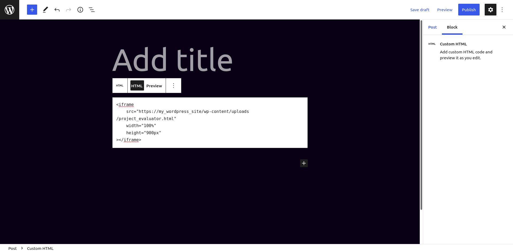
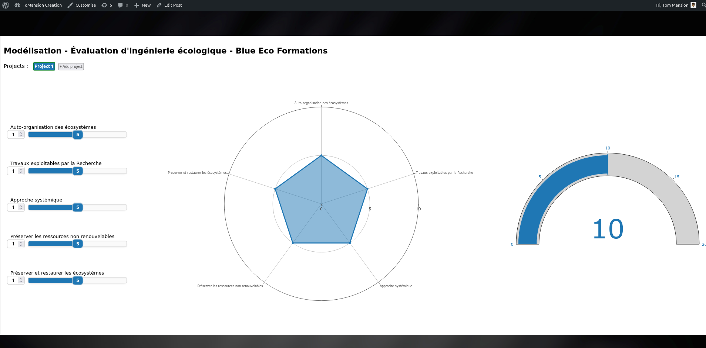

# How to deploy the tool to a Wordpress site

## Requierments

- The builded tool in a single HTML file named : "project_evaluator.html"
- Admin access to the Wordpress site

## Step 0

Download the HTML file where you can find it and open your Worpress admin panel.

## Step 1

Add the file to the Wordpress media library.



The tool should be available at "https://my_wordpress_site/wp-content/uploads/project_evaluator.html"

## Step 2

Add the tool to a page.

In a post or a page editor, add a custom HTML widget



Then copy the following iframe :

```html
<iframe
    src="https://my_wordpress_site/wp-content/uploads/project_evaluator.html"
    width="100%"
    height="900px"
></iframe>
```




The tool should be available !

